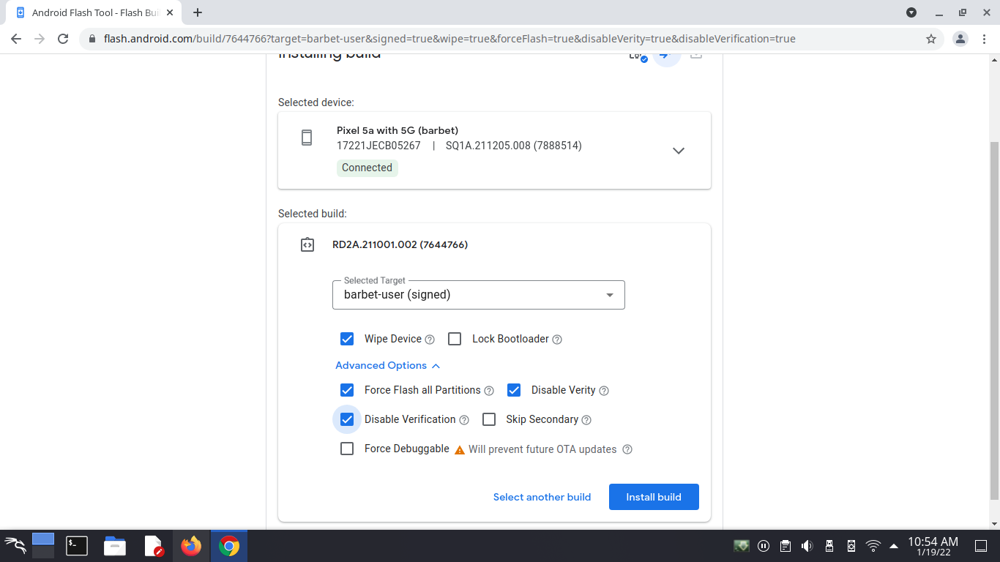

# Android Flash Tool

### The Minimum requirements to run the android flashing tool:

* Browser: Any browser supporting WebUSB, such as Chrome or Edge 79+
* Platforms: Linux, macOS, Chrome OS, Windows (requires an additional USB driver)


### Remove Your Screen Lock

Although not really required, it is recommended to completely remove all Google Accounts and your screen lock before you initiate the flashing process.


Using the [Android Flash Tool](https://flash.android.com) you will be able to unlock your boot loader, and flash the necessary stock image. You are going to want to flash build RD2A-211001.002 and select the following options shown in the picture below.

